# gcp-glb-ha-k8s

## Create the VM instance
In the Google Cloud console, create and start 3 instances for master and 3 instances for worker(Ubuntu 22.04 LTS Minimal).
> 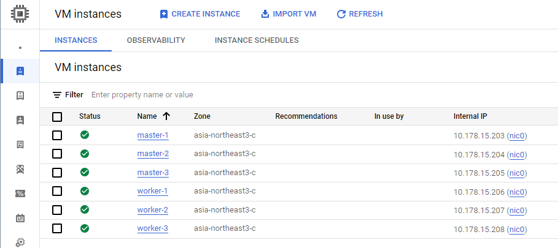

## Create Instance Group
Create a new unmanaged instance group and add only the master-1 instance as a member.
> 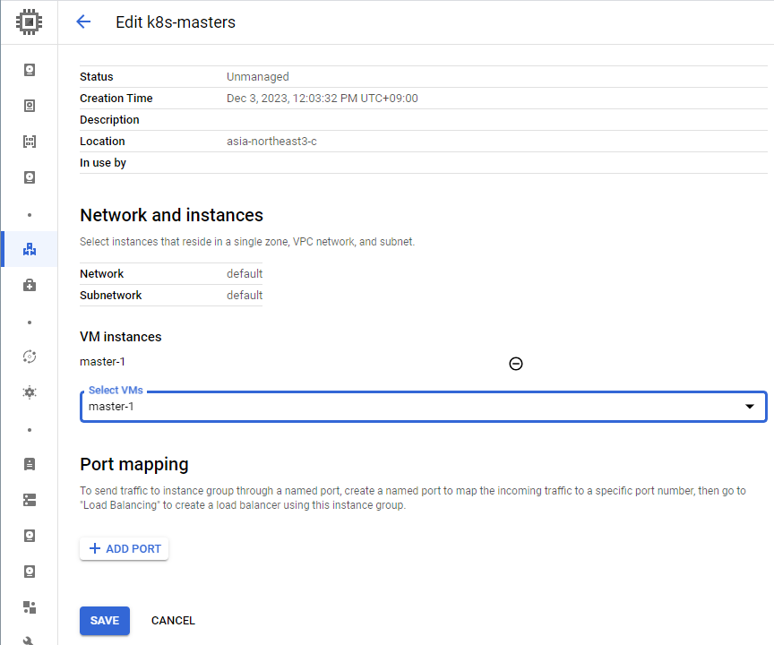

> 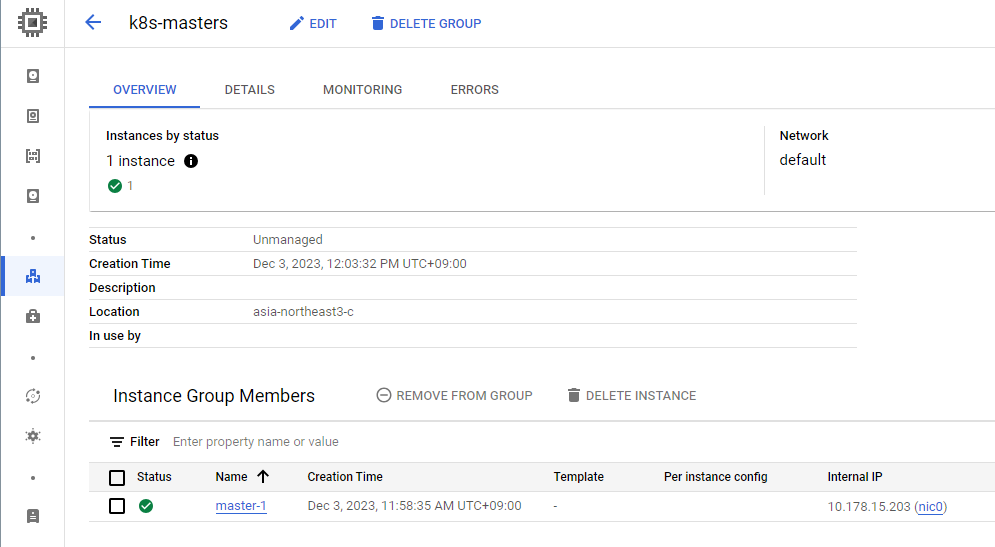

> 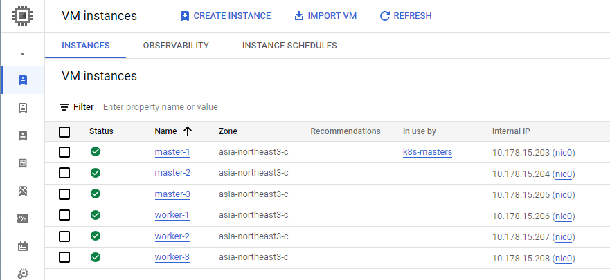

## Create a health check
Create a health check for use by the load balancer.
> 

## Create a load balancer
Create a Network Load Balancer (TCP/SSL) as a Layer 4 then select regional internal proxy load balancer and pass-through type.
> 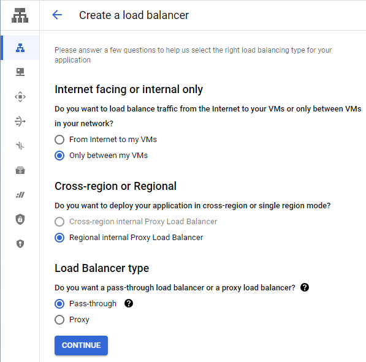

In the backend configuration, select pre-created a instance group and a status check.
Specify the IP address and the TCP port 6443 in the frontend configuration to be used by the plane control nodes.
> 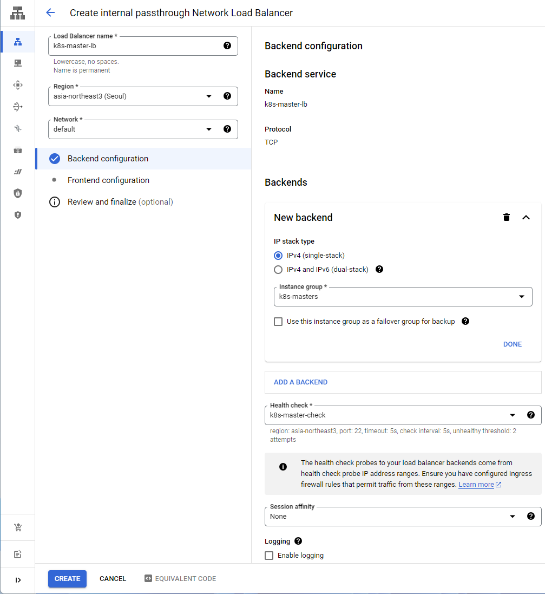

> 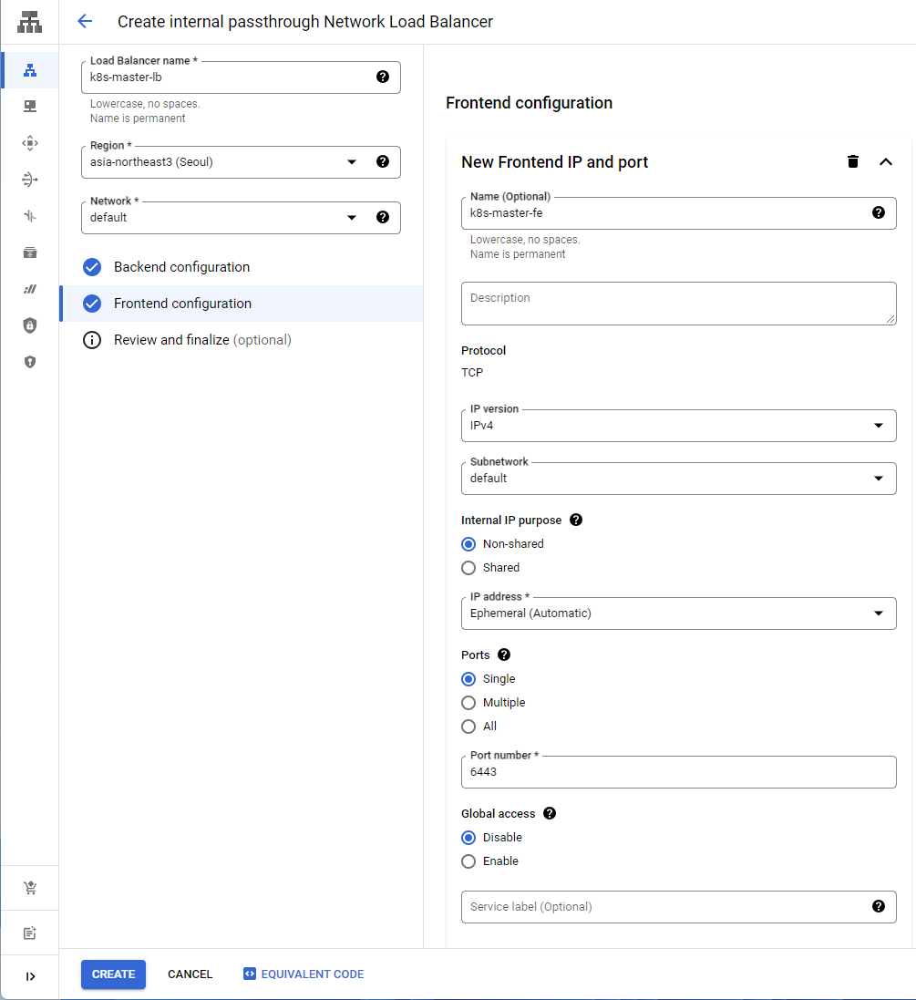

Complete the creation and check the details.
> 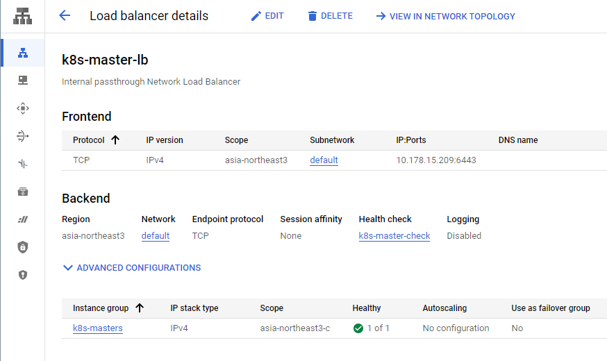  

## Create a DNS zone
In the Cloud DNS managed private zone, create custom record set to use more flexible DNS names for the load balancer IP.
> 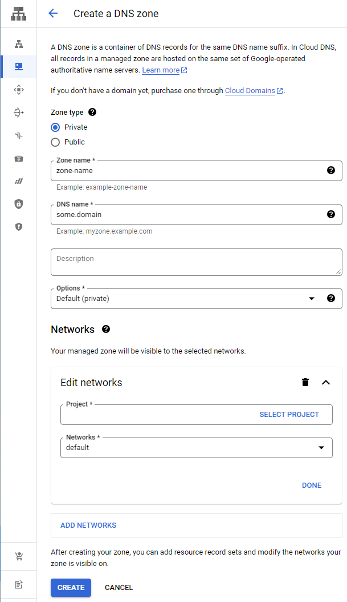

> 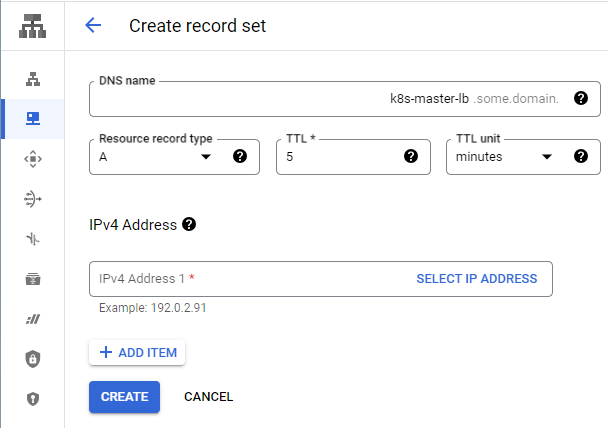

> 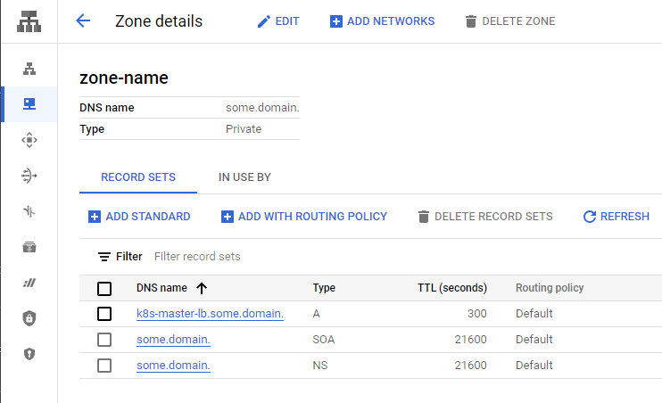

> In this example, the DNS name 'k8s-master-lb.some.domain' was used.

## Pre-Setting
All instances including master and worker.
```
$ sudo apt-get update
...

$ sudo apt-get install -y netcat vim tzdata apt-transport-https ca-certificates curl gpg gnupg lsb-release
...

$ sudo swapoff -a
$ sudo sed -i '/swap/s/^/#/' /etc/fstab

$ sudo vi /etc/sysctl.conf
...
net.ipv4.ip_forward=1 # uncomment
...

$ sudo sysctl -p
...
```

## Install Docker
Install Docker and cri-dockerd on all instances.

### [Install Docker Engine on Ubuntu](https://docs.docker.com/engine/install/ubuntu)
Add Docker's official GPG key:
```
$ sudo install -m 0755 -d /etc/apt/keyrings
$ curl -fsSL https://download.docker.com/linux/ubuntu/gpg | sudo gpg --dearmor -o /etc/apt/keyrings/docker.gpg
$ sudo chmod a+r /etc/apt/keyrings/docker.gpg
```
Add the repository to Apt sources:
```
$ echo \
  "deb [arch=$(dpkg --print-architecture) signed-by=/etc/apt/keyrings/docker.gpg] https://download.docker.com/linux/ubuntu \
  $(. /etc/os-release && echo "$VERSION_CODENAME") stable" | \
  sudo tee /etc/apt/sources.list.d/docker.list > /dev/null

$ sudo apt-get update
$ sudo apt-get install -y docker-ce docker-ce-cli containerd.io docker-buildx-plugin docker-compose-plugin docker-compose
```

### [Install cri-dockerd](https://github.com/Mirantis/cri-dockerd)
The easiest way to install cri-dockerd is to use one of the pre-built binaries or packages from the [releases page](https://github.com/Mirantis/cri-dockerd/releases).
```
$ VER=$(curl -s https://api.github.com/repos/Mirantis/cri-dockerd/releases/latest|grep tag_name | cut -d '"' -f 4|sed 's/v//g'); echo $VER
$ wget https://github.com/Mirantis/cri-dockerd/releases/download/v${VER}/cri-dockerd-${VER}.amd64.tgz
$ tar xvf cri-dockerd-${VER}.amd64.tgz
$ sudo mv cri-dockerd/cri-dockerd /usr/local/bin/

$ sudo cri-dockerd --version

$ wget https://raw.githubusercontent.com/Mirantis/cri-dockerd/master/packaging/systemd/cri-docker.service
$ wget https://raw.githubusercontent.com/Mirantis/cri-dockerd/master/packaging/systemd/cri-docker.socket
$ sudo mv cri-docker.socket cri-docker.service /etc/systemd/system/
$ sudo sed -i -e 's,/usr/bin/cri-dockerd,/usr/local/bin/cri-dockerd,' /etc/systemd/system/cri-docker.service

$ sudo systemctl daemon-reload
$ sudo systemctl enable cri-docker.service
$ sudo systemctl enable --now cri-docker.socket

$ sudo systemctl restart docker && sudo systemctl restart cri-docker
$ sudo systemctl status cri-docker.socket --no-pager 

$ sudo mkdir /etc/docker
$ cat <<EOF | sudo tee /etc/docker/daemon.json
{
  "exec-opts": ["native.cgroupdriver=systemd"],
  "log-driver": "json-file",
  "log-opts": {
    "max-size": "100m"
  },
  "storage-driver": "overlay2"
}
EOF

$ sudo systemctl restart docker && sudo systemctl restart cri-docker
$ sudo docker info | grep Cgroup

$ cat <<EOF | sudo tee /etc/modules-load.d/k8s.conf
br_netfilter
EOF

$ cat <<EOF | sudo tee /etc/sysctl.d/k8s.conf
net.bridge.bridge-nf-call-ip6tables = 1
net.bridge.bridge-nf-call-iptables = 1
EOF

$ sudo sysctl --system
```

## [Creating Highly Available Clusters with kubeadm](https://kubernetes.io/docs/setup/production-environment/tools/kubeadm/high-availability/)
> 

### [Installing kubeadm](https://kubernetes.io/docs/setup/production-environment/tools/kubeadm/install-kubeadm/)
These instructions are for Kubernetes 1.28:
```
$ sudo curl -fsSL https://pkgs.k8s.io/core:/stable:/v1.28/deb/Release.key | sudo gpg --dearmor -o /etc/apt/keyrings/kubernetes-apt-keyring.gpg
$ echo 'deb [signed-by=/etc/apt/keyrings/kubernetes-apt-keyring.gpg] https://pkgs.k8s.io/core:/stable:/v1.28/deb/ /' | sudo tee /etc/apt/sources.list.d/kubernetes.list

$ sudo apt-get update
$ sudo apt-get install -y kubelet kubeadm kubectl
$ sudo systemctl start kubelet && sudo systemctl enable kubelet

$ sudo apt-mark hold kubelet kubeadm kubectl
$ kubectl version --client=true

$ sudo kubeadm config images pull --cri-socket unix:///run/cri-dockerd.sock
```

### On the Master-1 instance, creating a cluster with kubeadm
Initializing control-plane node
```
master-1:$ sudo kubeadm init \
  --control-plane-endpoint=k8s-master-lb.some.domain:6443 \
  --pod-network-cidr=192.168.0.0/16 \
  --cri-socket unix:///run/cri-dockerd.sock \
  --upload-certs
...
To start using your cluster, you need to run the following as a regular user:

  mkdir -p $HOME/.kube
  sudo cp -i /etc/kubernetes/admin.conf $HOME/.kube/config
  sudo chown $(id -u):$(id -g) $HOME/.kube/config
...
You can now join any number of the control-plane node running the following command on each as root:

  kubeadm join k8s-master-lb.some.domain:6443 --token 47i1ik.mafrjp3yfvgwwqow \
        --discovery-token-ca-cert-hash sha256:092740c1375c7169ed607cfb48f6925f05bf416885ece4c1ee4f532f9bd837d8 \
        --control-plane --certificate-key 8c4a6be5e6137ace9905024c689c7ddb1ffa29d45ae7282e72151883211e4835
...
Then you can join any number of worker nodes by running the following on each as root:

  kubeadm join k8s-master-lb.some.domain:6443 --token 47i1ik.mafrjp3yfvgwwqow \
        --discovery-token-ca-cert-hash sha256:092740c1375c7169ed607cfb48f6925f05bf416885ece4c1ee4f532f9bd837d8

...
master-1:$ mkdir -p $HOME/.kube
master-1:$ sudo cp -i /etc/kubernetes/admin.conf $HOME/.kube/config
master-1:$ sudo chown $(id -u):$(id -g) $HOME/.kube/config
```
> 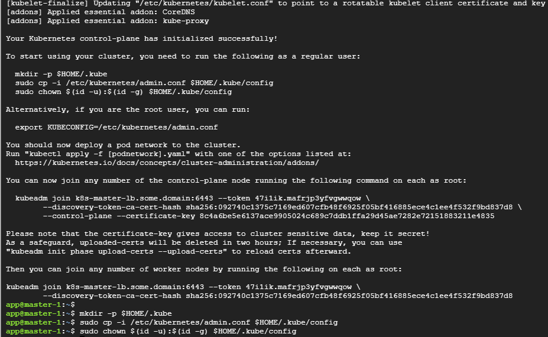

### [Quickstart for Calico on K8s](https://docs.tigera.io/calico/latest/getting-started/kubernetes/quickstart)
```
$ curl https://raw.githubusercontent.com/projectcalico/calico/v3.26.4/manifests/tigera-operator.yaml -O
$ curl https://raw.githubusercontent.com/projectcalico/calico/v3.26.4/manifests/custom-resources.yaml -O
$ kubectl create -f tigera-operator.yaml
$ kubectl create -f custom-resources.yaml
$ watch kubectl get pods -n calico-system
```

### Test the connection
```
$ nc -v k8s-master-lb.some.domain 6443
Connection to k8s-master-lb.some.domain 6443 port [tcp/*] succeeded!
```
> 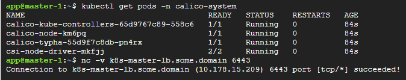

### On the other Master instances(2,3),  join the control-plane node
```
master-2:$ sudo kubeadm join k8s-lb:6443 --token ao655w.uvy196al3fxpk575 \
        --discovery-token-ca-cert-hash sha256:874a83374759b191e7dac2f58dd339536d5b286d47704270289b4a279d99f0e8 \
        --control-plane --certificate-key fbb0b5432e3597cbfb1b181a6e761ba810cc41b35f4c061272d39dc484b21df7 \
        --cri-socket unix:///run/cri-dockerd.sock \
        --v=10
...
```
```
master-3:$ sudo kubeadm join k8s-lb:6443 --token ao655w.uvy196al3fxpk575 \
        --discovery-token-ca-cert-hash sha256:874a83374759b191e7dac2f58dd339536d5b286d47704270289b4a279d99f0e8 \
        --control-plane --certificate-key fbb0b5432e3597cbfb1b181a6e761ba810cc41b35f4c061272d39dc484b21df7 \
        --cri-socket unix:///run/cri-dockerd.sock \
        --v=10
...
```
Run 'kubectl get nodes' on control-plane to see this machine join.
> 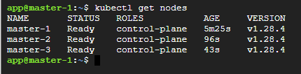

### On all Worker instances(1,2,3), join the worker node.
```
worker-1:$ sudo kubeadm join k8s-master-lb.some.domain:6443 --token 47i1ik.mafrjp3yfvgwwqow \
        --discovery-token-ca-cert-hash sha256:092740c1375c7169ed607cfb48f6925f05bf416885ece4c1ee4f532f9bd837d8 \
        --cri-socket unix:///run/cri-dockerd.sock \
        --v=10
```
```
worker-2:$ sudo kubeadm join k8s-master-lb.some.domain:6443 --token 47i1ik.mafrjp3yfvgwwqow \
        --discovery-token-ca-cert-hash sha256:092740c1375c7169ed607cfb48f6925f05bf416885ece4c1ee4f532f9bd837d8 \
        --cri-socket unix:///run/cri-dockerd.sock \
        --v=10
```
```
worker-3:$ sudo kubeadm join k8s-master-lb.some.domain:6443 --token 47i1ik.mafrjp3yfvgwwqow \
        --discovery-token-ca-cert-hash sha256:092740c1375c7169ed607cfb48f6925f05bf416885ece4c1ee4f532f9bd837d8 \
        --cri-socket unix:///run/cri-dockerd.sock \
        --v=10
```
Run 'kubectl get nodes' on control-plane to see this machine join.
> 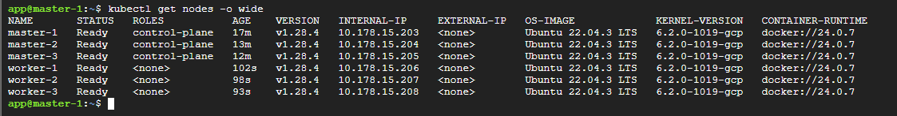

## Update Instance Group
Add master-2 and master-3 instances to the instance group.
> 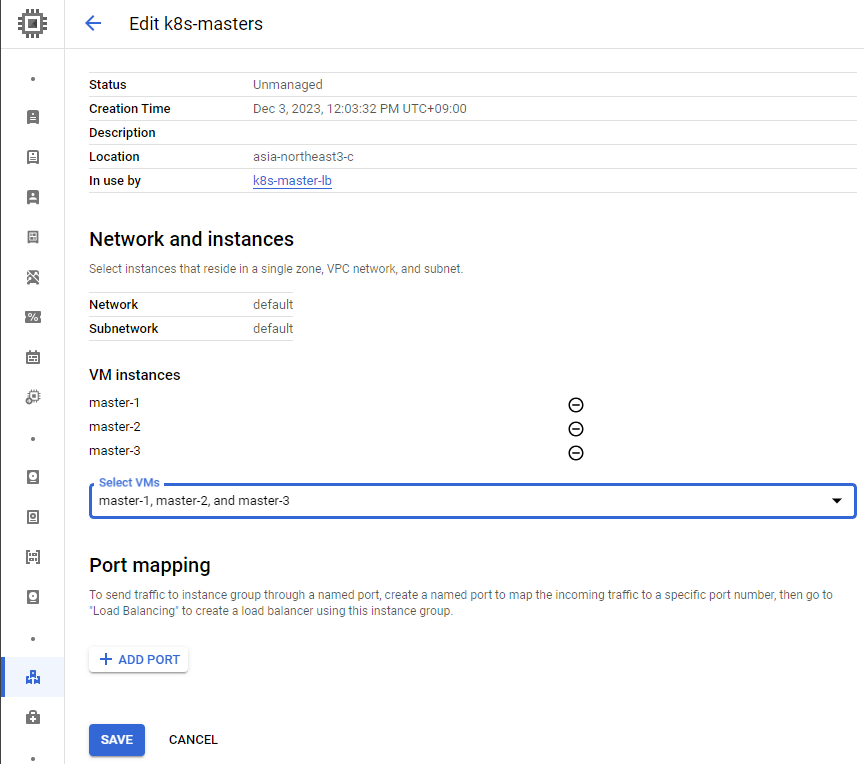

> 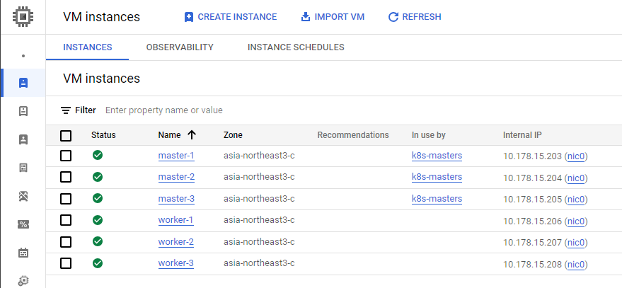

> 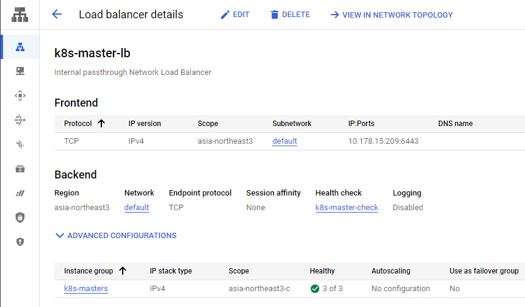
